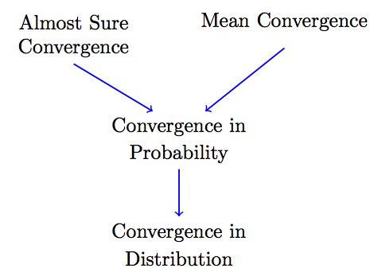
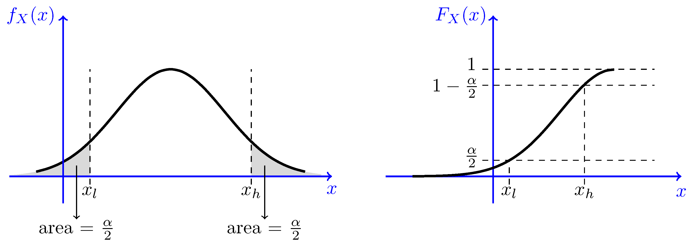
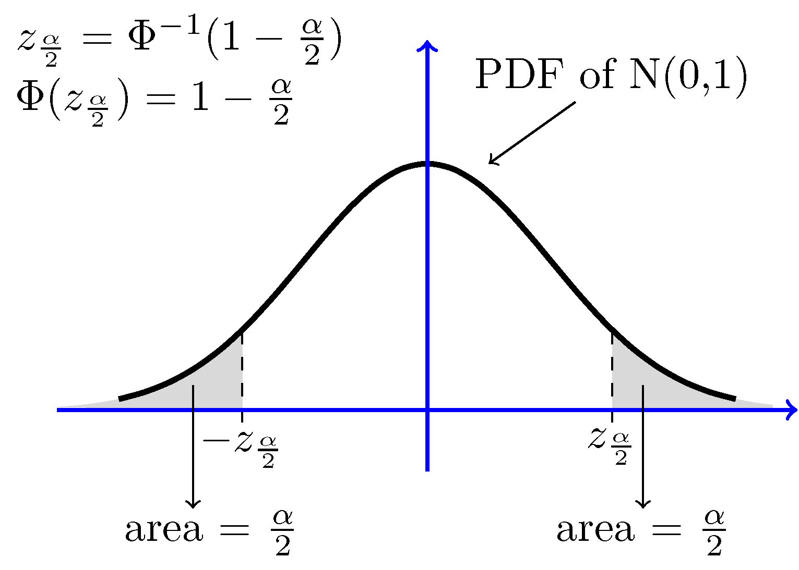

## References
- [10-page Probability Cheatsheet](https://raw.githubusercontent.com/wzchen/probability_cheatsheet/master/probability_cheatsheet.pdf): [pdf](https://raw.githubusercontent.com/wzchen/probability_cheatsheet/master/probability_cheatsheet.pdf) | [github](https://github.com/wzchen/probability_cheatsheet) | [website](http://www.wzchen.com/probability-cheatsheet/)
- [Introduction to Probability & Statistics](https://www.probabilitycourse.com/)
## Terminology

* **random experiment**: process by which we observe something uncertain
* **outcome**: result of a random experiment. 
* **sample space**:  set of all possible outcomes.
* When we repeat a random experiment several times, we call each one of them a **trial**.
* **events**: a set of possible outcomes; a subset of sample space

## Joint Distributions
#### Bivariate Normal Distribution
* $X$ and $Y$ are **bivariate normal** or **jointly normal**, if $aX+bY$ has a normal distribution $\forall$ $a,b \in \mathbb{ℝ}$. 
    * $X$ and $Y$ are jointly normal => they are individually normal as well.
    * If $X \sim N(\mu_X,\sigma_X^2)$ and $Y \sim N(\mu_Y,\sigma_Y^2)$ are independent, then they are jointly normal 
        * $X+Y \sim \hspace{5pt} N(\mu_X+\mu_Y,\sigma^2_X+\sigma^2_Y+2 \rho(X,Y) \sigma_X \sigma_Y)$
* **Standard Bivariate Normal Distribution** with correlation coefficient $\rho$:
    * $f_{XY}(x,y)=\frac{1}{2 \pi \sqrt{1-\rho^2}} \exp \{-\frac{1}{2 (1-\rho^2)} \big[ x^2-2\rho x y+y^2 \big] \}$
* **Bivariate Normal Distribution** with parameters $\mu_X$, $\mu_Y$, $\sigma_X^2$, $\sigma_Y^2$and $\rho$:
    * $f_{XY}(x,y) = \frac{1}{2 \pi \sigma_X \sigma_Y \sqrt{1-\rho^2}}  \cdot \exp \left\{-\frac{1}{2 (1-\rho^2)}\bigg[\bigg(\frac{x-\mu_X}{\sigma_X}\bigg)^2 +\bigg(\frac{y-\mu_Y}{\sigma_Y}\bigg)^2-2\rho \frac{(x-\mu_X)(y-\mu_Y)}{\sigma_X \sigma_Y} \bigg] \right\}$
* $X$ and $Y$ have bivariate normal distribution iff $\exists{Z_1, Z_2} \sim N(0,1)$  s.t.
    * $X=\sigma_X Z_1+\mu_X$ 
    * $Y=\sigma_Y (\rho Z_1 +\sqrt{1-\rho^2} Z_2)+\mu_Y$
    * This gives a way to generate jointly normal $X$ and $Y$ from standard normal $Z_1$ and $Z_2$.
* For jointly normal random variables, being independent and being uncorrelated are equivalent.

## Random Vectors
* $\mathbf{X} = [X_1, \dots, X_n]^T$ 
* $\mathbf{EX} = [EX_1, \dots, EX_n]^T$ 
* Correlation matrix of $X$: $\mathbf{R_X=E[X X^{T}]}$
* Covariance matrix of $X$: $\mathbf{C_X=E[(X-EX)(X-EX)^{T}]=R_X-EX EX^T}$
	* $\mathbf{C_X}$ is psd.
	* $\mathbf{C_X}$ is +ve definite iff all its eigenvalues are larger than zero or equivalently $\det(\mathbf{C_X}) > 0$ .
	* If $\mathbf{Y=A X+b}$, then $\mathbf{C_Y=A C_X A^T}$.
* **Cross Correlation matrix** of $X$ and $Y$: $\mathbf{R_{XY}=E[X Y^{T}]}$
* **Cross Covariance matrix** of $X$ and $Y$: $\mathbf{C_{XY}}=E[(X-EX)(Y-EY)^{T}]$
* **The Method of Transformations for Random Vectors**
    * Let 
        * $G:\mathbb{ℝ}^n \to \mathbb{ℝ}^n$ be a continuous and invertible function with continuous partial derivatives and let $H=G^{−1}$. 
        * $\mathbf{Y}=G(\mathbf{X})$ and $\mathbf{X}=G^{−1}(\mathbf{Y})=H(\mathbf{Y}) = [H_1(\mathbf{Y}), \dots H_n(\mathbf{Y})]^T$.
    * Then 
        * PDF of $\mathbf{Y}$ is: $f_{\mathbf{Y}}(\mathbf{y})=f_{\mathbf{X}}\big(H(\mathbf{y})\big) |J|$
        * where $J$ is the Jacobian of $H$ evaluated at $\mathbf{Y}$:
        
$$
\begin{aligned}
	J = \det  \begin{bmatrix}
        \frac{\partial H_1}{\partial y_1} & \frac{\partial H_1}{\partial y_2} & ... & \frac{\partial H_1}{\partial y_n}  \\
        \frac{\partial H_2}{\partial y_1} & \frac{\partial H_2}{\partial y_2} & ... & \frac{\partial H_2}{\partial y_n}  \\
          \vdots &\vdots &\vdots &\vdots \\
        \frac{\partial H_n}{\partial y_1} & \frac{\partial H_n}{\partial y_2} &... & \frac{\partial H_n}{\partial y_n}  \\
      \end{bmatrix} (y_1, \dots, y_n),
\end{aligned}
$$
* If $\mathbf{Y=A X+b}$, then $f_{\mathbf{Y}}(\mathbf{y})=\frac{1}{|\det(\mathbf{A})|}f_{\mathbf{X}}\big(\mathbf{A}^{-1}(\mathbf{y-b}) \big)$.

* **Normal (Gaussian) Random Vectors  ** 
    * Random variables $X_1, \dots, X_n$ are said to be **jointly normal** if $a_1X_1+a_2X_2+...+a_nX_n$ is normal $\forall{a_i} \in \mathbb{R}$
    * Random vector $\mathbf{X} = [X_1, \dots, X_n]^T$ is said to be **normal** or **Gaussian** if $X_1, \dots, X_n$ are **jointly normal**.
    * For _standard normal random vector_ $f_{\mathbf{Z}}(\mathbf{z})=\frac{1}{(2\pi)^{\frac{n}{2}}} \exp \left\{-\frac{1}{2} \mathbf{z}^T\mathbf{z} \right\}.$
    * **Multivariate Normal Distribution** with mean $\mathbf{m}$ and covariance matrix $\mathbf{C}$:
        * $f_{\mathbf{X}}(\mathbf{x})=\frac{1}{(2\pi)^{\large{\frac{n}{2}}} \sqrt{\det\textbf{C}}} \exp \left\{-\frac{1}{2} (\textbf{x}-\textbf{m})^T \mathbf{C}^{-1}(\textbf{x}-\textbf{m}) \right\}$
    * $\mathbf{X}$ has multivariate normal distribution with mean $\mathbf{m}$ and **+ve definite** covariance matrix $\mathbf{C}$ iff there exists a standard normal $\mathbf{Z}$ s.t.
        * $\mathbf{X = AZ + m}$ where $\mathbf{A}$ is a matrix s.t. $\mathbf{A} \mathbf{A}^{T}= \mathbf{A}^{T}\mathbf{A}=\mathbf{C}$ 
            * Note that $\mathbf{A}=\mathbf{Q} \mathbf{D}^{\frac{1}{2}} \mathbf{Q}^T$ where $\mathbf{C}=\mathbf{Q} \mathbf{D} \mathbf{Q}^T$
        * This gives a way to generate normal $\mathbf{X} \sim N(\mathbf{m}, {C})$ from standard normal $\mathbf{Z}$.
	* For a normal $\mathbf{X}$, following are equivalent:
        * $X_i$'s are independent 
        * $X_i$'s are uncorrelated
        * $\mathbf{C_X}$ is diagonal.
    * If $\mathbf{X} \sim N(\mathbf{m}, {C})$ then $\mathbf{Y=A X+b} \sim N(\mathbf{A}E\mathbf{X}+\mathbf{b},\mathbf{A} \mathbf{C} \mathbf{A}^T)$

## Probability Bounds
* **Union Bound**
    * For any events $A\_1, A\_2, ..., A_n$, we have, $P\biggl(\bigcup_{i=1}^n A_i\biggr) \leq \sum_{i=1}^n P(A_i)$
* **Bonferroni Inequalities** 
    * Generalization of the Union Bound using Inclusion-Exclusion Principle
* **Markov's Inequality**
	* If $X$ is any _nonnegative_ random variable, then
        * $P(X \geq a) \leq \frac{EX}{a}, \qquad \textrm{for any } a>0$
        * Derive using definition of $EX$
* **Chebyshev's Inequality** 
    * If $X$ is any random variable, then
        * $P\big(|X-EX|\geq b\big) \leq \frac{Var(X)}{b^2} , \qquad \textrm{for any } b>0$
    * Derive using Markov's Inequality
* **Chernoff Bounds** (derive using Markov Ineq)
    * $P(X \geq a)\leq e^{-sa}M_X(s), \qquad \textrm{for all } s>0$
    * $P(X \leq a)\leq e^{-sa}M_X(s), \qquad \textrm{for all } s<0$
    * where, $M_X(s) = E[e^{sX}]$ is the moment generating function.
    * Derive using Markov's Inequality
* **Cauchy-Schwarz**: $|EXY| \leq \sqrt{E[X^2] E[Y^2]}$

## Convergence of Random Variables
* 
* Convergence of a sequence of random variables $X1, X2, X3, ⋯$ to random variable $X$.

#### Convergence in distribution
* $X_n \ \xrightarrow{L^{\large r}}\ X$ if, $\lim_{n \rightarrow \infty} F_{X_n}(x)=F_X(x)$,
    * for all $x$ at which $F_X(x)$ is continuous
* _Central Limit Theorem_

#### Convergence in probability
* $X_n \ \xrightarrow{L^{\large r}}\ X$ if, $\lim_{n \rightarrow \infty} P\big(|X_n-X| \geq \epsilon \big)=0, \qquad \textrm{ for all }\epsilon>0$
* _Weak Law of large Numbers_

#### Convergence in mean:
* $X_n \ \xrightarrow{L^{\large r}}\ X$ if, $\lim_{n \rightarrow \infty} E\left(|X_n-X|^{\large r}\right)=0$
* if $r = 2$, **mean-square convergence**: $X_n \ \xrightarrow{m.s.}\ X$

#### Almost sure convergence
* $S$ is the sample space of $X_i$ and $X$
* $X_n \ \xrightarrow{a.s.}\ X$ if $P\left( \left\{s \in S: \lim_{n\rightarrow \infty} X_n(s)=X(s)\right\}\right)=1$
* $X_n \ \xrightarrow{a.s.}\ X$ if $\sum_{n=1}^{\infty} P\big(|X_n-X| > \epsilon \big) < \infty, \qquad \textrm{ for all }\epsilon>0$
* $X_n \ \xrightarrow{a.s.}\ X$ _iff_ $\lim_{m\rightarrow \infty} P(A_m) =1, \qquad \textrm{ for all }\epsilon>0$   
    * where, $A_m=\{|X_n-X|< \epsilon, \qquad   \textrm{for all }n \geq m \}.$
* _Strong Law of large Numbers_

#### Continuous Mapping Theorem
* For a _continuous_ $h: \mathbb{R} \mapsto \mathbb{R}$
* $X_n \ \xrightarrow{d}\ X \implies h(X_n) \ \xrightarrow{d}\ h(X)$
* $X_n \ \xrightarrow{p}\ X \implies h(X_n) \ \xrightarrow{p}\ h(X)$
* $X_n \ \xrightarrow{a.s.}\ X \implies h(X_n) \ \xrightarrow{a.s.}\ h(X)$

## Statistical Inference I: **Frequentist Inference** 
#### Point Estimators
* In Frequentist Inference, $\theta$ is a deterministic (non-random) unknown/parameter that is to be estimated from the observed data.
* _Point estimator_ $\hat{\Theta}$  for $\theta$ is a function of the random sample $X_1,X_2,\cdots,X_n$
    * $\hat{\Theta}=h(X_1,X_2,\cdots,X_n)$ 
* _Bias_: $B(\hat{\Theta})=E[\hat{\Theta}]-\theta$ 
* _Unbiased Estimator_: $B(\hat{\Theta}) = 0$
* _Mean Squared Error_: $MSE(\hat{\Theta}) =E\big[(\hat{\Theta}-\theta)^2\big] =\mathrm{Var}(\hat{\Theta}-\theta)+\big(E[\hat{\Theta}-\theta]\big)^2 =\mathrm{Var}(\hat{\Theta})+B(\hat{\Theta})^2$
* $\hat{\Theta}$ is a _consistent estimator_ for $\theta$ 
    * if $\lim_{n \rightarrow \infty} P\big(|\hat{\Theta}_n-\theta| \geq \epsilon \big)=0, \textrm{ for all }\epsilon>0$.
    * if $\lim_{n \rightarrow \infty} MSE(\hat{\Theta}_n)=0$.
    * i.e. as the sample size  gets larger, $\hat{\Theta}$ converges to the real value of $\theta$.
* Let $X_1,X_2,\cdots,X_n$be a random sample with 
    * mean: $EX_i=\mu<\infty$, variance: $0<\mathrm{Var}(X_i)=\sigma^2<\infty$, 
    * PDF: $f_X(x)$ and CDF: $F_X(X)$.
* _Order Statistics_: $X_{(1)},X_{(2)},\cdots,X_{(n)}$ : the random samples in ascending order.
    * $X_{(1)} = min(X_1,X_2,\cdots,X_n)$, $X_{(n)} = max(X_1,X_2,\cdots,X_n)$
    * PDF: $f_{X_{(i)}}(x)=\frac{n!}{(i-1)!(n-i)!}f_X(x) \big[ F_X(x)\big]^{i-1} \big[1-F_X(x) \big]^{n-i}$
    * CDF: $F_{X_{(i)}}(x)=\sum_{k=i}^{n} {n \choose k} \big[ F_X(x)\big]^{k} \big[1-F_X(x) \big]^{n-k}$
    * Joint PDF: 
$$
\begin{aligned}
    f_{X_{(1)},\cdots, X_{(n)}}(x_1,x_2, \cdots, x_n) &=
     &\left\{
      \begin{array}{l l}
        n!f_X(x_1)f_X(x_2) \cdots f_X(x_n)  &  \quad  \textrm{for }x_1 \leq x_2 \leq x_2 \cdots \leq x_n \\
          &  \quad   \\
        0 &  \quad \text{otherwise}
      \end{array} \right.
\end{aligned}
$$
* _Sample Mean_: $\overline{X}=\frac{X_1+X_2+...+X_n}{n}$: unbiased and consistent estimator of $\mu$.
    * $E[\overline X] = \mu$, $Var(\overline X) = \frac{\sigma^2}{n}$ 
* _Sample Variance_: ${S}^2=\frac{1}{n-1} \sum_{k=1}^n (X_k-\overline{X})^2=\frac{1}{n-1} \left(\sum_{k=1}^n X^2_k-n\overline{X}^2\right)$: unbiased and consistent estimator of $\sigma^2$.
* _Sample Standard Deviation_: $S = \sqrt{S^2}$: biased estimator of $\sigma$
* _Maximal Likelihood Estimate_: $\theta_{ML} = \arg\max\limits_\theta L(x_1, x_2, \cdots, x_n; \theta)$
* _Maximal Likelihood Estimator_: $\Theta_{ML} = \Theta_{ML}(X_1, X_2, \cdots, X_n)$ s.t. $\Theta_{ML}(x_1, x_2, \cdots, x_n) = \theta_{ML}$
    * MLE is asymtotically consistent: $\lim_{n \rightarrow \infty} P(|\hat{\Theta}_{ML}-\theta|>\epsilon)=0$
    * MLE is asymtotically unbiased: $\lim_{n \rightarrow \infty} E[\hat{\Theta}_{ML}]=\theta$
    * As $n$ becomes large, $\frac{\hat{\Theta}_{ML}-\theta}{\sqrt{\mathrm{Var}(\hat{\Theta}_{ML})}}  \xrightarrow{d} N(0, 1)$
#### Confidence Interval Estimation
* Let $X_1,X_2,\cdots,X_n$be a random sample with 
    * mean: $EX_i=\mu<\infty$, variance: $0<\mathrm{Var}(X_i)=\sigma^2<\infty$, 
    * PDF: $f_X(x)$ and CDF: $F_X(X)$. 
* Let $\theta$ be the distribution parameter to be estimated.
* _Interval Estimator_ with _confidence level_ $1-\alpha$: 
    * Two estimators $\Theta_{l} = \Theta_{l}(X_1, X_2, \cdots, X_n)$ and $\Theta_{h} = \Theta_{h}(X_1, X_2, \cdots, X_n)$ s.t.
    * $P\bigg(\hat{\Theta}_l \leq \theta \leq \hat{\Theta}_h\bigg) \geq 1-\alpha$, for all possible $\theta$
* Equivalently, $[\hat\Theta_l, \hat\Theta_h]$ is a $(1 - \alpha)100\%$ _confidence interval_ for $\theta$.
* Finding Interval Estimators
    * Detour: Finding $x_l$ and $x_h$ s.t. $P\bigg(x_l \leq \theta \leq x_h\bigg) = 1-\alpha$.
    * One solution: $x_l= F^{-1}_X\left(\frac{\alpha}{2}\right)$ and $x_h= F^{-1}_X\left(1-\frac{\alpha}{2}\right)$
    * 
    * Example: the $(1-\alpha)$ interval for $Z \sim N(0, 1)$ is given by $[-z_{\frac{\alpha}{2}}, z_{\frac{\alpha}{2}}]$ 
        * where, $z_p=\Phi^{-1}(1-p)$ where $\Phi$ is CDF of Z.
        * In particular, 95% confidence interval is given $[-1.96, 1.96]$
        * 
    * _Pivotal Quantity_: $Q$ is a _pivot_ if,
        * $Q = Q(X_1, X_2, \cdots, X_n, \theta)$ i.e. it doesn't depend on any unknown parameter other than $\theta$ and,
        * its distribution does not depend on $\theta$ or any other unknown parameters. 
    * _Pivotal Method for finding Confidence Intervals_
            1. Find a pivotal quantity $Q = Q(X_1, X_2, \cdots, X_n, \theta)$ 
            * pivots already available for most important cases that appear in practice.
            3. Find an interval for $Q$ such that, $P\bigg(q_l \leq Q \leq q_h\bigg) = 1-\alpha$ 
            4. Using algebraic manipulations, convert the above equation to $P\bigg(\hat{\Theta}_l \leq \theta \leq \hat{\Theta}_h\bigg) = 1-\alpha$
        * Examples of known Interval Estimators: 
            * Given a random sample $X_1, X_2, \cdots, X_n$ want to estimate $\theta = EX_i$.
                * Assumption: $n$ is large => can use CLT and sample statistics like $\overline X$ and $S^2$.
            * Example 1:
                * Assumptions: 
                    * **known variance** $Var(X_i) = \sigma^2 < \infty$:
                * $\left[\overline{X}- z_{\frac{\alpha}{2}} \frac{\sigma}{\sqrt{n}} , \overline{X}+ z_{\frac{\alpha}{2}} \frac{\sigma}{\sqrt{n}}\right]$: approximate $(1 - \alpha)100\%$ confidence interval for $\theta$. 
                   * approximate because CLT was used.
            * **unknown variance**:
                * Option 1: Use an upper bound for $\sigma^2$: $\sigma_{max} \geq \sigma$ 
                    * $\left[\overline{X}- z_{\frac{\alpha}{2}} \frac{\sigma_{max}}{\sqrt{n}} , \overline{X}+ z_{\frac{\alpha}{2}} \frac{\sigma_{max}}{\sqrt{n}}\right]$: a **valid but conservative** $(1 - \alpha)100\%$ confidence interval for $\theta$.
                * Option 2: Use a point estimate for $\sigma^2$: $\hat\sigma^2$
                    * Use of point estimate leads to additional approximation in intervals.
                    * Example 2:
                        * Assumptions: random sample is from $Bernoulli(\theta)$.
                        * $\left[\overline{X}- z_{\frac{\alpha}{2}}\sqrt{\frac{\overline{X}(1-\overline{X})}{n}} , \overline{X}+ z_{\frac{\alpha}{2}}\sqrt{\frac{\overline{X}(1-\overline{X})}{n}}\right]$ : approximate $(1 - \alpha)100\%$ confidence interval for $\theta$.
                            * Using $\hat\sigma^2 = \hat\theta(1 - \hat\theta) = \overline{X}(1-\overline{X})$ 
                    * **Example 3:**
                        * $\left[\overline{X}- z_{\frac{\alpha}{2}} \frac{S}{\sqrt{n}} , \overline{X}+ z_{\frac{\alpha}{2}} \frac{S}{\sqrt{n}}\right]$: approximate $(1 - \alpha)100\%$ confidence interval for $\theta$.
                            * Using sample variance as point estimate: $\hat\sigma^2 = S = \sqrt{\frac{1}{n-1} \sum_{k=1}^n (X_k-\overline{X})^2}=\sqrt{\frac{1}{n-1} \left(\sum_{k=1}^n X^2_k-n\overline{X}^2\right)}$
#### [Confidence Intervals for Normal Samples](https://www.probabilitycourse.com/chapter8/8_3_3_confidence_intervals_for_norm_samples.php)
* Let $X_1,X_2,\cdots,X_n$ be $n$ i.i.d. $N(\mu, \sigma^2)$ r.v. with sample mean and variance $\overline X$ and $S^2$ respectively.
    * then $\overline X$ and $S^2$ are independent
* **Chi-Squared distribution** 
    * $\chi^2(n) = Gamma(\frac{n}{2}, \frac{1}{2})$ 
    * Use to estimate variance of normal random variables
        * Let $Y=\frac{(n-1)S^2}{\sigma^2}=\frac{1}{\sigma^2}\sum_{i=1}^{n} (X_i-\overline{X})^2$ then $Y \sim \chi^2(n-1)$
* **Student's t-distribution** 
    * $T=\frac{Z}{\sqrt{Y / n}}$ where $Z \sim N(0, 1)$ and $Y \sim \chi^2(n)$ are independent r.v.
    * Use to estimate mean of normal random variables
        * Let $T=\frac{\overline{X}-\mu}{S / \sqrt{n}}$  then $T \sim T(n-1)$

## Random Processes
#### Basics
* terminology:
    * random or stochastic process
    * **continuous-time** random process: $\big\{X(t),  t \in J \big\}$, where $J$ is an interval such as $[0, 1]$, $[0, \infty]$, $[-\infty, \infty]$, etc.
    * **discrete-time** random process (or a **random sequence**): $\big\{X(n)=X_n,  n \in J \big\}$ where $J$ is a countable set such as $\mathbb{Z}$ or $\mathbb{N}$.
    * A random process is a **random function** of time.
        * **Realization** or **sample function**  or **sample path** of $X(t)$.
* CDF: $F_{X(t_1)X(t_2)\cdots X(t_n)}(x_1,x_2,\cdots, x_n)=P\big(X(t_1) \leq x_1, X(t_2) \leq x_2, \cdots, X(t_n) \leq x_n\big)$
* **Mean Function**: $\mu_X(t):J \rightarrow \mathbb{R}$ s.t. $\mu_X(t)=E[X(t)]$
* **(Auto)correlation Function**: $R_X(t_1,t_2)=E[X(t_1)X(t_2)], \quad \textrm{for }t_1,t_2 \in J.$
    * $R_X(t, t) = E(X(t)^2)$
* **(Auto)covariance Function**: $C_X(t_1,t_2)=\textrm{Cov}\big(X(t_1),X(t_2)\big) =R_X(t_1,t_2)-\mu_X(t_1) \mu_X(t_2), \quad \textrm{for }t_1,t_2 \in J.$
    * $C_X(t, t) = Var(X(t))$
* **crosscorrelation Function**: $R_{XY}(t_1,t_2)=E[X(t_1)Y(t_2)], \quad \textrm{for }t_1,t_2 \in J.$
    * $R_X(t, t) = E(X(t)^2)$ - **expected (average) power**
* **crosscovariance Function**: $C_{XY}(t_1,t_2)=\textrm{Cov}\big(X(t_1),Y(t_2)\big) =R_{XY}(t_1,t_2)-\mu_X(t_1) \mu_Y(t_2), \quad \textrm{for }t_1,t_2 \in J.$
    * $C_X(t, t) = Var(X(t))$
* **Independent Random Processes**: 
    * $F_{X(t_1), X(t_2), \cdots, X(t_m), Y(t'_1), Y(t'_2), \cdots, Y(t'_n)}(x_1,x_2,\cdots,x_m,y_1,y_2,\cdots, y_n) = F_{X(t_1), X(t_2), \cdots, X(t_m)}(x_1,x_2,\cdots,x_m) \cdot F_{Y(t'_1), Y(t'_2), \cdots, Y(t'_n)}(y_1,y_2,\cdots, y_n)$ 
        * for all $t_i \in J$, $t_j \in J'$ and $x_i, y_i \in \mathbb{R}$ 

#### Stationary Processes
* The following definitions assume these two random processes:
    * continuous-time r.p. $\big\{X(t),  t \in \mathbb{R} \big\}$
    * discrete-time r.p. $\big\{X(n)=X_n,  n \in \mathbb{Z} \big\}$
* **Strict-sense stationary** (or simply **stationary**)
    * continuous-time: $F_{X(t_1) X(t_2) \cdots X(t_r)}(x_1,x_2,\cdots, x_r)= F_{X(t_1+\Delta) X(t_2+\Delta) \cdots X(t_r+\Delta)}(x_1,x_2,\cdots, x_r)$  for all $t_i, \Delta \in \mathbb{R}$, $x_i \in \mathbb{R}$.
    * discrete-time:  $F_{X(n_1) X(n_2) \cdots X(n_r)}(x_1,x_2,\cdots, x_n)= F_{X(n_1+D) X(n_2+D) \cdots X(n_r+D)}(x_1,x_2,\cdots, x_r)$ for all $n_i, D \in \mathbb{Z}$, $x_i \in \mathbb{R}$.
* **Weak-sense stationary** or **Wide-sense stationary** (**WSS**)
    * continuous-time: $\mu_X(t) = \mu_X$ and $R_X(t1, t2) = R_X(t1-t2)$
    * discrete-time: $\mu_X(n) = \mu_X$ and $R_X(n1, n2) = R_X(n1-n2)$
    * Properties of the correlation function of WSS r.p.s $R_X(\tau)$
        * **expected (average) power** constant in time $E[X(t)^2] = R_X(0)$
        * $R_X(0) \geq 0$
        * $R_X(\tau)=R_X(-\tau),  \quad \textrm{for all } \tau \in \mathbb{R}.$ (even function)
        * $|R_X(\tau)|\leq R_X(0),  \quad \textrm{for all } \tau \in \mathbb{R}.$ - (prove using Cauchy-Shwartz)
* **Jointly Wide-Sense Stationary** : $X(t)$ and $Y(t)$ are JWSS if 
    * both are WSS
    * $R_{XY}(t_1,t_2)=R_{XY}(t_1-t_2)$.
* **Cyclostationary Processes**
    * _Strict-Sense_: $\exists{T}$ such that $X(t_1), X(t_2), \cdots, X(t_r)$ has same joint CDF as $X(t_1 + T), X(t_2 + T), \cdots, X(t_r + T)$.
    * _Weak-Sense_: $\exists{T}$ such that $\mu_X(t+T) = \mu_X(t)$ and $R_X(t1+T, t2+T) = R_X(t1, t2)$.
    * Similarly for discrete-time.
* Calculus of Random Processes
    * **Mean-square continuous**: $\lim_{\delta\rightarrow 0} E\bigg[\big|X(t+\delta)-X(t)\big|^2\bigg]=0.$
    * Derivatives and integrals are linear operations and hence can often be interchanged with expectation.
        * $E\left[\int_{0}^{t} X(u)du\right]=\int_{0}^{t}E[X(u)]du$
        * $E\left[\frac{d}{dt} X(t)\right]= \frac{d}{dt} E[X(t)].$

#### Gaussian Random Processes
* $\big\{X(t),  t \in J \big\}$ is a **Gaussian (normal) random process** if, $X(t_1), \dots, X(t_n)$ are jointly normal $\forall{t_i} \in J$
    * For normal random processes, wide-sense stationarity and strict-sense stationarity are equivalent.
* $\big\{X(t),  t \in J \big\}$ $\big\{Y(t),  t \in J' \big\}$ are **Jointly Gaussian (normal) random processes** if, $X(t_1), \dots, X(t_n), Y(t'_1), \dots, Y(t'_n)$ are jointly normal $\forall{t_i} \in J$ and $\forall{t'_i} \in J'$
    * For jointly Gaussian random processes being uncorrelated and being independent are equivalent.

#### Poisson Process
#### Discrete-Time Markov Chain

